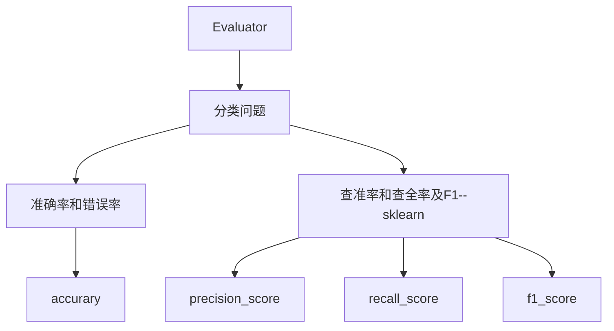

# 模型评估方法

对一个已经训练好的模型进行评估是十分重要的步骤，其目的是评价所训练模型的泛化性，通常在机器学习的模型中，将数据集分为训练集和测试集，测试集在模型上的预测结果反应了该模型的预测能力和泛化性。如果模型在训练集和测试集表现都十分优秀，证明该模型的泛化很好。

那如何刻画模型在数据集表现呢？

## 代码结构

## 分类模型评估方法

对于分类问题来说，通常分为二分类问题和多分类问题，为了方便在此均考虑多分类问题可用的模型性能评价指标。

### 精度与错误率：accuracy

这是判断分类器最基本的两个性能指标

**精度：**分类正确的样本占样本总数的比例

**错误率：**分类错误的样本占样本总数的比例

查准率

