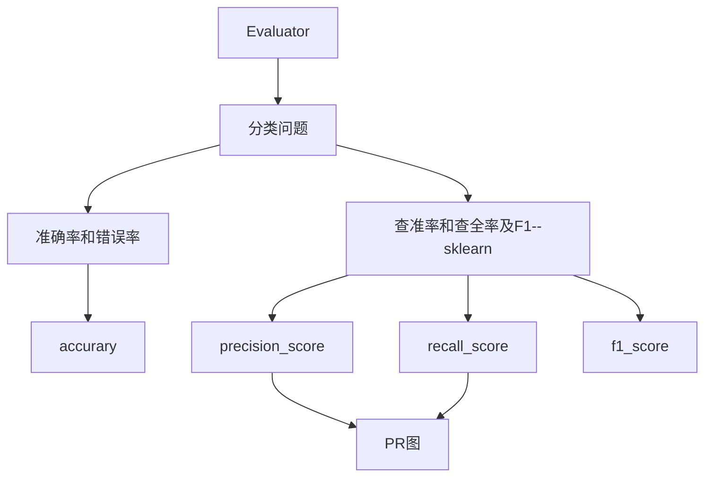

# 模型评估方法

对一个已经训练好的模型进行评估是十分重要的步骤，其目的是评价所训练模型的泛化性，通常在机器学习的模型中，将数据集分为训练集和测试集，测试集在模型上的预测结果反应了该模型的预测能力和泛化性。如果模型在训练集和测试集表现都十分优秀，证明该模型的泛化很好。

那如何刻画模型在数据集表现呢？

## 代码结构

## 分类模型评估方法

对于分类问题来说，通常分为二分类问题和多分类问题，为了方便在此均考虑多分类问题可用的模型性能评价指标。

### 精度与错误率：accuracy

这是判断分类器最基本的两个性能指标

__精度__

分类正确的样本占样本总数的比例

__错误率__

分类错误的样本占样本总数的比例

### 查准率、查全率及F1

更加详细的描述分类器的性能特征的指标

对于二分类以及多分类问题，可将预测样例的结果分为以下四种情况：

- 真正例（true position）：样本为正例且分类器预测为正例的样本，如果为多分类问题，则定义为样本为该类别且分类器正确预测为该类别的样本。
- 假正例（false position）：样本为反例且分类器预测为正例的样本，如果为多分类问题，则定义为样本为其他类别且分类器错误预测为该类别的样本。
- 真反例（true position）：样本为反例且分类器预测为反例的样本，如果为多分类问题，则定义为样本为其他类别且分类器正确预测为其他类别的样本。
- 假反例（false position）：样本为正例且分类器预测为反例的样本，如果为多分类问题，则定义为样本为该类别且分类器错误预测为其他类别的样本。

由此产生了查准率和查全率两个性能指标参数。

__查准率__

预测为正例的样本中正确预测的样本数的比例。

__查全率__ 

真实样本中为正例的样本中正确预测的样本数的比例。

一般来说，查准率与查全率相互矛盾，若希望所有的正例都被预测出来，那么会增加被预测为正例的数量，那么正确预测的比例就会降低。而要增加正确预测的比例，那么在预测方面就会更加谨慎，预测为正例的数量就会变少，就会漏掉一些正例样本

#### PR图

PR曲线是以查准率为纵坐标，以查全率为横坐标的曲线，以分类器判断该样本可能为正例（在多分类问题中为该类）的可能性作为依据进行排序，每次可以计算出当此的查全率、查准率，由此构成的曲线为PR曲线。

通常PR曲线的面积越大，证明该分类器在该测试集上表现的越好，为了更好的度量PR曲线的优劣，提出了BHP度量方法

BHP（Break-Event Point），简称平衡点，它是“查准率==查全率”时的取值

#### F1

F1则是基于查全率和查准率的综合性参数
